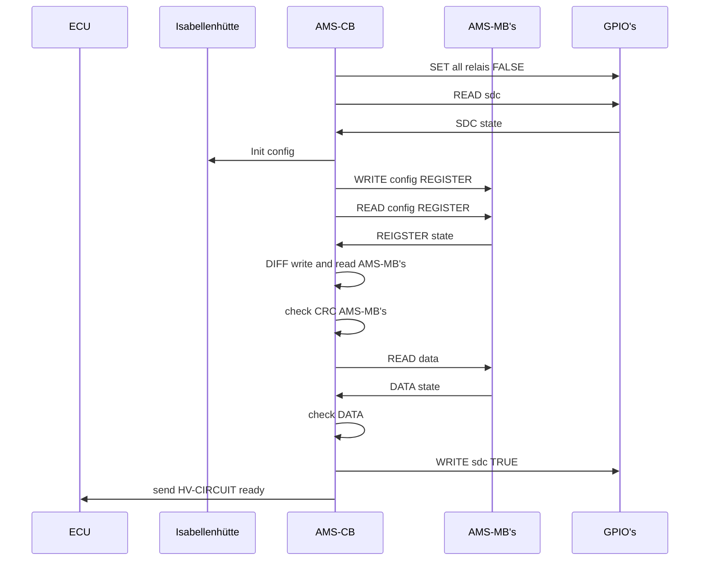
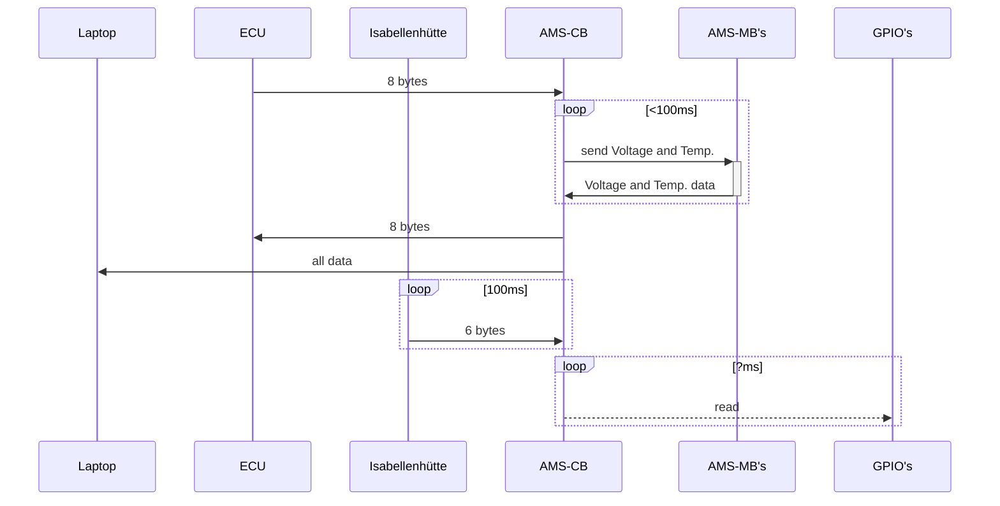

# BMS_zephyr

## Activation and Configuration Sequence Diagram
The following sequence diagram illustrates the activation and configuration process, detailing the interactions between components during system initialization.

## Loops Sequence Diagram
The following sequence diagram illustrates the interactions between various components, including their communication loops and timings.

