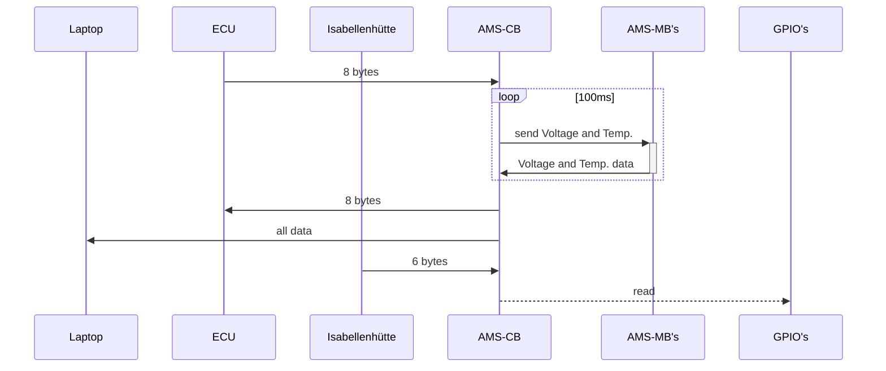

# BMS_zephyr

```mermaid
sequenceDiagram
    participant laptop as Laptop
    participant ecu as ECU
    participant ivt-s as Isabellenhütte
    participant nucleo as AMS-CB
    participant adbms as AMS-MB's
    participant gpio as GPIO's

    ecu->>nucleo: 8 bytes
    loop 100ms
    nucleo->>+adbms: send Voltage and Temp.
    adbms->>-nucleo: Voltage and Temp. data
    end
    nucleo->>ecu: 8 bytes
    nucleo->>laptop: all data
    ivt-s->>nucleo: 6 bytes
    nucleo-->>gpio: read
    

```

