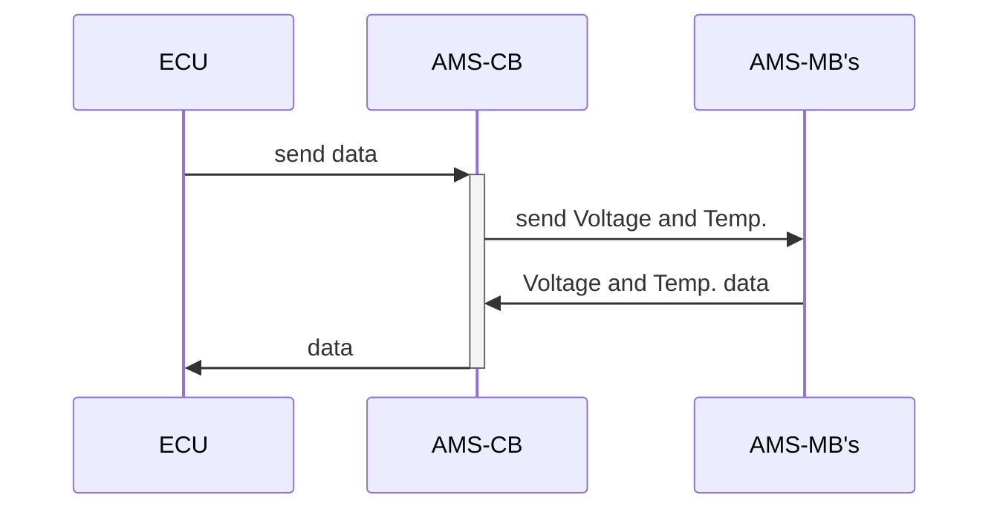

# BMS_zephyr

```mermaid
sequenceDiagram
    participant ecu as ECU 
    participant nucleo as AMS-CB
    participant adbms as AMS-MB's

    ecu->>+nucleo: send data
    nucleo->>adbms: send Voltage and Temp.
    adbms->>nucleo: Voltage and Temp. data
    nucleo->>-ecu: data
```