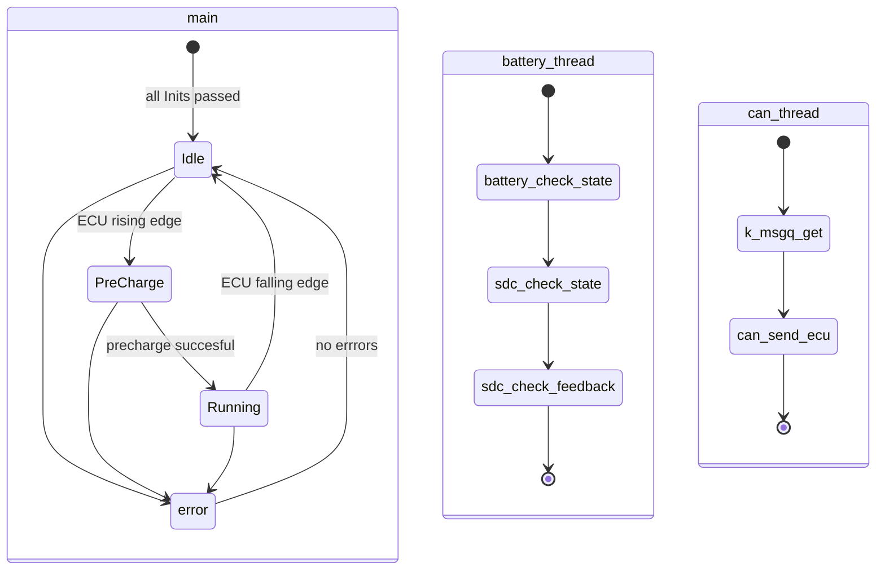
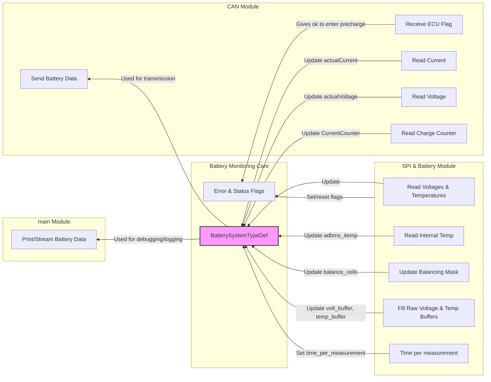

```ASCII
     _    __  __ ____         ____ ____    _____          _                
    / \  |  \/  / ___|       / ___| __ )  |__  /___ _ __ | |__  _   _ _ __ 
   / _ \ | |\/| \___ \ _____| |   |  _ \    / // _ \ '_ \| '_ \| | | | '__|
  / ___ \| |  | |___) |_____| |___| |_) |  / /|  __/ |_) | | | | |_| | |   
 /_/   \_\_|  |_|____/       \____|____/  /____\___| .__/|_| |_|\__, |_|   
                                                   |_|          |___/   
```

## Software Deployment
To install the necessary software on your Ubuntu system, follow these steps:

The used Ubuntu version for this project was **Ubuntu 24.04**
1. **Check and update your Ubuntu version**:
    ```sh
    lsb_release -a
    sudo apt update
    sudo apt upgrade
    ```

2. **Install Zephyr**:

    Follow the [Zephyr Project's Getting Started Guide](https://docs.zephyrproject.org/latest/getting_started/index.html) to set up the Zephyr environment.
    The following verisons were used for this project:
    - Zephyr: **4.1.0**
        ```sh
        cat ~/zephyrproject/zephyr/VERSION
        ```
    - West: **1.3.0** (west -V)
        ```sh
        cd ~/zephyrproject/zephyr/
        west -V
        ```
    - Zephyr SDK: **0.17.0**

3. **Clone the repository**:
    ```sh
    git clone https://github.com/hackerluca/BMS_zephyr.git
    cd BMS_zephyr
    ```
4. **Build the project**:
    ```sh
    west build -p always -b nucleo_l432kc <PATH>/BMS_zephyr/BMS_l432kc/
    ```

5. **install STMCubeProgrammer**
    Install [STM32CubeProgrammer](https://www.st.com/en/development-tools/stm32cubeprog.html)

6. **install st-link-tools**
    ```sh
    sudo apt install stlink-tools
    ```
    After installing stlink tools you can check for devices with:
    ```sh
    st-info --probe
    ```
    This should detect the microcontroller. When a device is detected you should be able to flash the software.

7. **Flash the firmware**:
    ```sh
    west flash
    ```

# Class Diagram
The class diagram shows the different classes used and their depencies to each other. As a first instance only public function are declared to get an overall view of the program.


# State Diagram
The state diagram shows the three loops of the software. The main loop contains a statemachine. The Battery Thread contains a cyclic check of all battery values and other safety functions. The CAN Thread listens for incoming CAN-messages and sends the collected data and status to the ECU.



## Dataflow and Communication

The following diagram illustrates the data flow and communication between the main modules of the BMS software. It shows how data is exchanged between the CAN module, the battery monitoring core, the serial monitor, and the SPI/battery module (ADBMS). Each module is responsible for specific tasks, such as receiving and sending CAN messages, updating battery data, handling error and status flags, reading sensor values via SPI, and outputting data for debugging or logging. The arrows indicate the direction of data transfer or control signals.


---