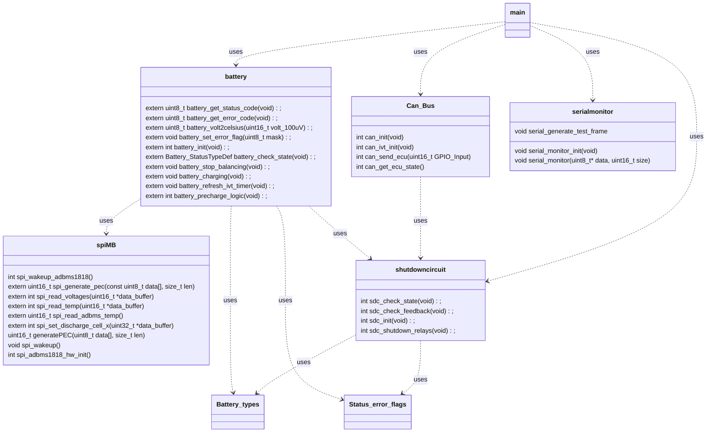

```ASCII
     _    __  __ ____         ____ ____    _____          _                
    / \  |  \/  / ___|       / ___| __ )  |__  /___ _ __ | |__  _   _ _ __ 
   / _ \ | |\/| \___ \ _____| |   |  _ \    / // _ \ '_ \| '_ \| | | | '__|
  / ___ \| |  | |___) |_____| |___| |_) |  / /|  __/ |_) | | | | |_| | |   
 /_/   \_\_|  |_|____/       \____|____/  /____\___| .__/|_| |_|\__, |_|   
                                                   |_|          |___/   
```

## Software Deployment
To install the necessary software on your Ubuntu system, follow these steps:

The used Ubuntu version for this project was **Ubuntu 24.04**
1. **Check and update your Ubuntu version**:
    ```sh
    lsb_release -a
    sudo apt update
    sudo apt upgrade
    ```

2. **Install Zephyr**:

    Follow the [Zephyr Project's Getting Started Guide](https://docs.zephyrproject.org/latest/getting_started/index.html) to set up the Zephyr environment.
    The following verisons were used for this project:
    - Zephyr: **4.1.0**
        ```sh
        cat ~/zephyrproject/zephyr/VERSION
        ```
    - West: **1.3.0** (west -V)
        ```sh
        cd ~/zephyrproject/zephyr/
        west -V
        ```
    - Zephyr SDK: **0.17.0**

3. **Clone the repository**:
    ```sh
    git clone https://github.com/hackerluca/BMS_zephyr.git
    cd BMS_zephyr
    ```
4. **Build the project**:
    ```sh
    west build -p always -b nucleo_l432kc <PATH>/BMS_zephyr/BMS_l432kc/
    ```

5. **install STMCubeProgrammer**
    Install [STM32CubeProgrammer](https://www.st.com/en/development-tools/stm32cubeprog.html)

6. **install st-link-tools**
    ```sh
    sudo apt install stlink-tools
    ```
    After installing stlink tools you can check for devices with:
    ```sh
    st-info --probe
    ```
    This should detect the microcontroller. When a device is detected you should be able to flash the software.

7. **Flash the firmware**:
    ```sh
    west flash
    ```

# Class Diagram
The class diagram shows the different classes used and their depencies to each other. As a first instance only public function are declared to get an overall view of the program.


---


---
# 🖥️ Battery Dashboard — Deployment Guide

This guide walks you through setting up and running the Zurich UAS Racing Battery Monitoring Dashboard using Flask and Serial data.

---

## 📁 Structure

```
Dashboard/
├── battery_web_dashboard.py            # Backend
├── web_dashboard_final.html            # Frontend
├── static/
│   └── black_logo_white_background.jpg # Zurich UAS logo
```


## 🔧 Requirements

Make sure you have the following installed:

- Python 3.8+
- pip
- USB access to your microcontroller board

### Install dependencies:

```bash
pip install flask pyserial numpy
```


## 🚀 Running the Dashboard

1. **Connect your UART device**
2. **Start the server**:

```bash
python3 battery_web_dashboard.py
```

3. When prompted, select the correct UART port number (e.g., `/dev/ttyACM0` or `COM3`).

4. Open your browser and go to:

```
http://localhost:5000
```

## 🌐 Features

- **Live voltage & temperature heatmaps** (auto-updating)
- **Detailed summary panel** with:
  - Voltages (min, max, mean)
  - Temperatures (min, max, mean)
  - Current, cycle time, error codes, etc.
- **Console log stream** from the device


## ⚠️ Troubleshooting

- **Blank page or 404 error?**
  - Make sure Flask is running and port 5000 is not blocked.
- **Logo not showing?**
  - Ensure `black_logo_white_background.jpg` is in the `/static` directory.
- **No UART data?**
  - Verify the microcontroller is sending properly formatted frames.

---

