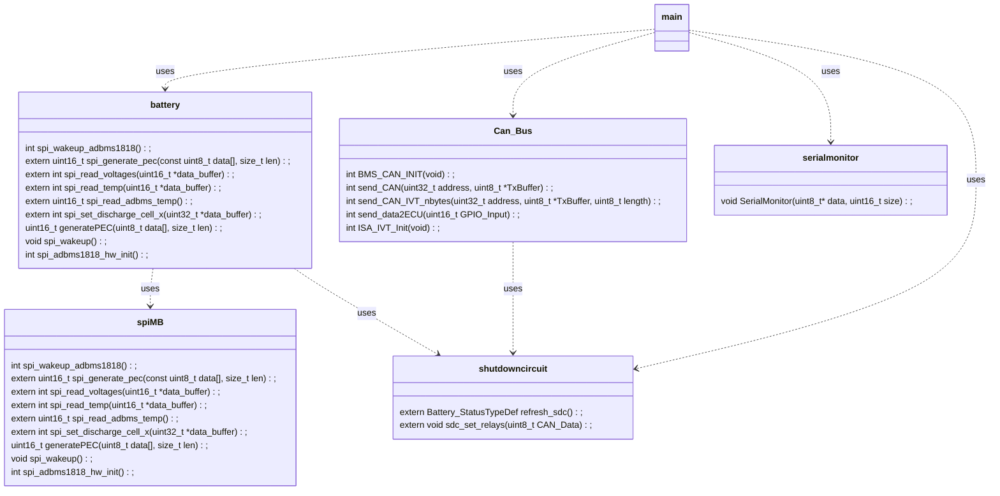

```ASCII
     _    __  __ ____         ____ ____    _____          _                
    / \  |  \/  / ___|       / ___| __ )  |__  /___ _ __ | |__  _   _ _ __ 
   / _ \ | |\/| \___ \ _____| |   |  _ \    / // _ \ '_ \| '_ \| | | | '__|
  / ___ \| |  | |___) |_____| |___| |_) |  / /|  __/ |_) | | | | |_| | |   
 /_/   \_\_|  |_|____/       \____|____/  /____\___| .__/|_| |_|\__, |_|   
                                                   |_|          |___/   
```

## Software Deployment
To install the necessary software on your Ubuntu system, follow these steps:

The used Ubuntu version for this project was **Ubuntu 24.04**
1. **Check and update your Ubuntu version**:
    ```sh
    lsb_release -a
    sudo apt update
    sudo apt upgrade
    ```

2. **Install Zephyr**:

    Follow the [Zephyr Project's Getting Started Guide](https://docs.zephyrproject.org/latest/getting_started/index.html) to set up the Zephyr environment.
    The following verisons were used for this project:
    - Zephyr: **4.1.0**
        ```sh
        cat ~/zephyrproject/zephyr/VERSION
        ```
    - West: **1.3.0** (west -V)
        ```sh
        cd ~/zephyrproject/zephyr/
        west -V
        ```
    - Zephyr SDK: **0.17.0**

3. **Clone the repository**:
    ```sh
    git clone https://github.com/hackerluca/BMS_zephyr.git
    cd BMS_zephyr
    ```
4. **Build the project**:
    ```sh
    west build -p always -b nucleo_l432kc <PATH>/BMS_zephyr/BMS_l432kc/
    ```

5. **install STMCubeProgrammer**
    Install [STM32CubeProgrammer](https://www.st.com/en/development-tools/stm32cubeprog.html)

6. **install st-link-tools**
    ```sh
    sudo apt install stlink-tools
    ```
    After installing stlink tools you can check for devices with:
    ```sh
    st-info --probe
    ```
    This should detect the microcontroller. When a device is detected you should be able to flash the software.

7. **Flash the firmware**:
    ```sh
    west flash
    ```

## Activation and Configuration Sequence Diagram
The following sequence diagram illustrates the activation and configuration process, detailing the interactions between components during system initialization.


## Loops Sequence Diagram
The following sequence diagram illustrates the interactions between various components, including their communication loops and timings.


## Class Diagram
The class diagram shows the different classes used and their depencies to each other. As a first instance only public function are declared to get an overall view of the program.



